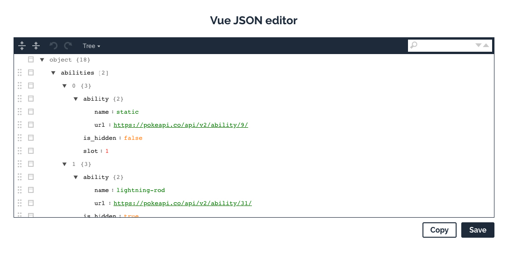

# Vue editor



Using `vue-json-editor` and `svg-symbol-sprite-loader` together

## Project setup
```
npm install
```

### Compiles and hot-reloads for development
```
npm run serve
```

### Compiles and minifies for production
```
npm run build
```

### Lints and fixes files
```
npm run lint
```

### Publish in Github Pages
```
npm run deploy
```

### Customize configuration
See [Configuration Reference](https://cli.vuejs.org/config/).