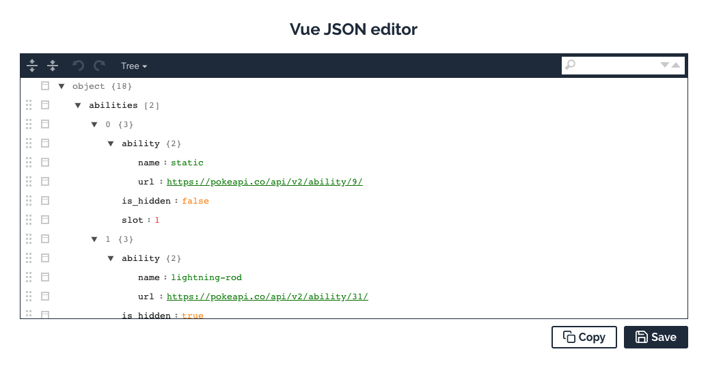
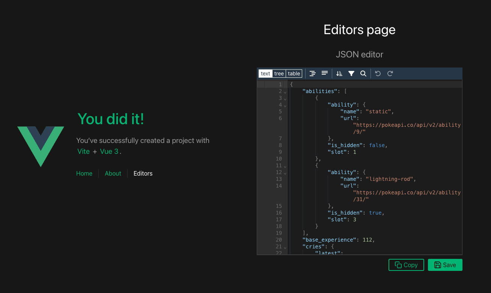

# Vue editor

| v1                                               | v2                                               |
| ------------------------------------------------ | ------------------------------------------------ |
|  |  |
| `vue@2`                                          | `vue@2`                                          |
| `@vue/cli` </br> `webpack` </br> `babel`         | `vite`                                           |
| `vue-json-editor`                                | `json-editor-vue`                                |
| `svg-symbol-sprite-loader`                       | `vite-plugin-svg-icons`                          |
| `vue-clipboard2`                                 | `v-clipboard`                                    |

## 🎯 Description

✨&nbsp; This repo was created to demonstrate that `vue-json-editor` and `svg-symbol-sprite-loader` packages can coexist together.

🐛 &nbsp; Since when I used both packages in a project some incompatibility errors occurred and the default json editor icons were not displayed.

Maybe someone will find it helpful too 😁

## 🏗️ Developed with

- The [`vue-json-editor`](https://www.npmjs.com/package/vue-json-editor) package is a vue component that can be used to create a json editor.

- The [`svg-symbol-sprite-loader`](https://www.npmjs.com/package/svg-symbol-sprite-loader) package is a webpack loader and plugin for creating SVG sprites.  
Reference: [Using SVG symbol sprites with Vue](https://stefan-dietz.eu/vue-svg-symbol-sprites.html)

## 🚀 Commands

### Install dependencies

```bash
npm install
```

### Compiles and hot-reloads for development

```bash
npm run serve
```

### Compiles and minifies for production

```bash
npm run build
```

### Lints and fixes files

```bash
npm run lint
```

### Publish in Github Pages

```bash
npm run deploy
```
