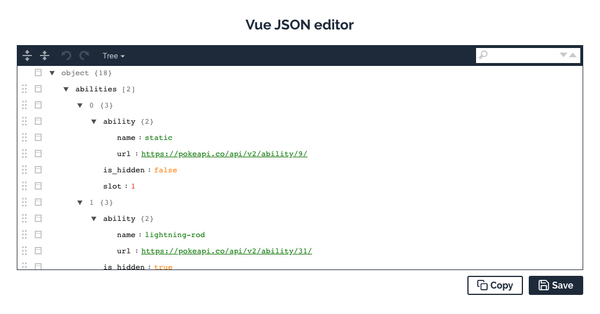
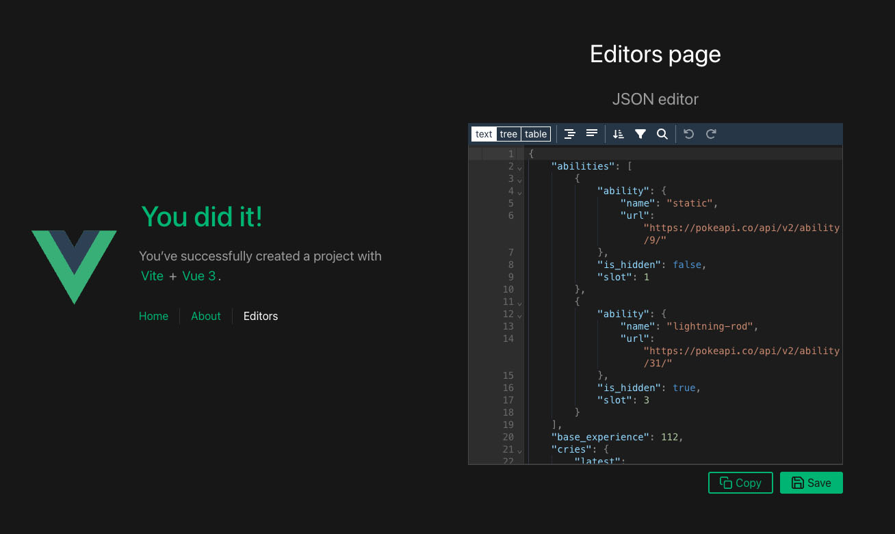

  


# Vue editor

| v1                                               | v2                                               |
| ------------------------------------------------ | ------------------------------------------------ |
|  |  |

## 🎯 Description

✨&nbsp; This repo was created to demonstrate that `vue-json-editor` and `svg-symbol-sprite-loader` packages can coexist together.

🐛 &nbsp; Since when I used both packages in a project some incompatibility errors occurred and the default json editor icons were not displayed.

Maybe someone will find it helpful too 😁

## 🔖 Tags versions

| v1                                       | v2                      |
| ---------------------------------------- | ----------------------- |
| `vue@2`                                  | `vue@2`                 |
| `@vue/cli` </br> `webpack` </br> `babel` | `vite`                  |
| `vue-json-editor`                        | `json-editor-vue`       |
| `svg-symbol-sprite-loader`               | `vite-plugin-svg-icons` |
| `vue-clipboard2`                         | `v-clipboard`           |

### [v1.x.x](https://github.com/beatrizsmerino/vue-editor/releases/tag/1.0.0)

- The [`vue-json-editor`](https://www.npmjs.com/package/vue-json-editor) package is a vue component that can be used to create a json editor.
- The [`svg-symbol-sprite-loader`](https://www.npmjs.com/package/svg-symbol-sprite-loader) package is a `webpack` loader and plugin for [creating SVG symbol sprites with Vue](https://stefan-dietz.eu/vue-svg-symbol-sprites.html).
- The [`vue-clipboard2`](https://www.npmjs.com/package/vue-clipboard2) package is a simple modern approach to copy text to clipboard using [`clipboard.js`](https://clipboardjs.com) in Vue.

### [v2.x.x](https://github.com/beatrizsmerino/vue-editor/releases/tag/2.0.0)

- This release has followed the [official migration guide from @vue/cli to vite](https://vueschool.io/articles/vuejs-tutorials/how-to-migrate-from-vue-cli-to-vite/) to take advantage of performance improvements and ease of configuration. Unlike [`@vue/cli`](https://cli.vuejs.org/), which uses `webpack` and `babel`, [`vite`](https://www.npmjs.com/package/vite) takes advantage of modern JavaScript features such as native `ES modules`, making the development process faster and more efficient.

Because of this, several packages have had to be replaced to be compatible with `vite`:
- The [`json-editor-vue`](https://www.npmjs.com/package/json-editor-vue) package is used instead of `vue-json-editor`.
- The [`vite-plugin-svg-icons`](https://www.npmjs.com/package/vite-plugin-svg-icons) package is used instead of `svg-symbol-sprite-loader`.
- The [`v-clipboard`](https://www.npmjs.com/package/v-clipboard) package is used instead of `vue-clipboard2`.

## 🚀 Commands

| v1       | v2        |
| -------- | --------- |
| `serve`  | `dev`     |
| `build`  | `build`   |
|          | `preview` |
| `lint`   | `lint`    |
| `deploy` | `deploy`  |

### Install dependencies

Install all dependencies listed in `package.json`.

```bash
npm install
```

### Clean install dependencies

Remove `node_modules` and `package-lock.json` to reinstall from scratch.

```bash
npm run install:clean
```

### Lint after install

Runs automatically after `npm install` to run `npm run lint` on all project files.

```bash
npm run postinstall
```

### Set up Husky git hooks

Runs automatically after `postinstall` to enable `pre-commit` and `commit-msg` hooks of [Husky](https://typicode.github.io/husky/).

```bash
npm run prepare
```

### Compiles and hot-reloads for development

Launch the development server on `localhost` with hot reload. Use `serve` for v1 (`Vue CLI`) or `dev` for v2 (`Vite`).

```bash
npm run serve
```

```bash
npm run dev
```

### Compiles and minifies for production

Build and minify the project for production.

```bash
npm run build
```

### Preview build code for production

Preview the production build locally before deploying. Only available in v2 (`Vite`).

```bash
npm run preview
```

### Lints and fixes files

Run [Prettier](https://prettier.io/) (`prettier:fix`), [ESLint](https://eslint.org/) (`eslint:fix`) and [Stylelint](https://stylelint.io/) (`stylelint:fix`) to format and lint all project files.

```bash
npm run lint
```

### Format files with Prettier

Format CSS, SCSS, JSON, YAML, JS and Vue files with [Prettier](https://prettier.io/).

```bash
npm run prettier:fix
```

### Lint and fix files with ESLint

Lint and fix JSON, JS and Vue files with [ESLint](https://eslint.org/).

```bash
npm run eslint:fix
```

### Lint and fix styles with Stylelint

Lint and fix CSS, SCSS and Vue files with [Stylelint](https://stylelint.io/).

```bash
npm run stylelint:fix
```

### Publish in Github Pages

```bash
npm run deploy
```

## 📄 License

This project is licensed under the `MIT` License, which allows free use, modification and distribution. See [LICENSE](LICENSE) for details.
